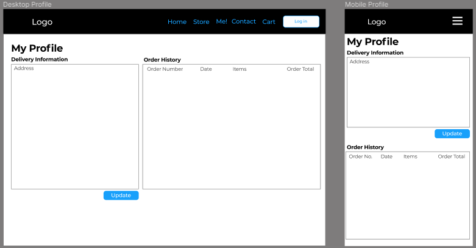

# Graphic Designer Website

This website has been created to allow a graphic designer to showcase and sell their work/prints. The deployed site can be viewed 
[here](https://graphic-designer-website.herokuapp.com/)


## Table of Contents
1. [UX](#ux)
    - [User Stories](#user-stories)
    - [Design](#design)
    - [Wireframes](#wireframes)
3. [Database](#Database)
2. [Technologies Used](#technologies-used)
3. [Testing](#testing)
4. [Deployment](#deployment)
5. [Credits](#credits)
    - [Content](#content)
    - [Acknowledgements](#acknowledgements)

---

## UX
This website has been created using Django for the backend. The design is my own inspired by the graphic designers work utilizing bootstrap.

### User Stories

### Viewing/Navigation
| ID 	| AS A/AN 	| I WANT TO BE ABLE TO...                                   	| SO THAT I CAN...                                          	|Testing/ Functionality
|----	|---------	|-----------------------------------------------------------	|-----------------------------------------------------------	|-----------------------------------------------------------
| 1  	| Shopper 	| View all products and services                            	| Purchase one or more product/service                      	| All Products, Stickers and Prints nav links direct shoppers to   the correct pages
| 2  	| Shopper 	| View individual product and service details               	| Identify a product/service: Price, Description, Image     	| Information is displayed on Products and Product Details Pages
| 3  	| Shopper 	| View owner portfolio                                      	| View owners previous work, before purchasing              	| Shopper can view all products on Products page
| 4  	| Shopper 	| View the total for all products/services in shopping cart 	| View total price of all products/services I wish to order 	| Shooper can view the total price in several locations: Bag icon in nav bar, Messages as products are added and removed from bag, the bag page and the checkout page.

### Registration/User Accounts
| ID 	| AS A/AN   	| I WANT TO BE ABLE TO...                               	| SO THAT I CAN...                                           	|Testing/ Functionality
|----	|-----------	|-------------------------------------------------------	|------------------------------------------------------------	|-----------------------------------------------------------
| 1  	| Site User 	| Register an account                                   	| Purchase products/services                                 	| Users can register accounts
| 2  	| Site User 	| Have a user profile                                   	| View order history and update payment/shipping information 	| Order history is display within my profile located on the navbar
| 3  	| Site User 	| Log in/Log out                                        	| Keep my personal information safe                          	| Users can Log in and log out 
| 4  	| Site User 	| Recover Password                                      	| Recover access to account if password forgotten            	| Users can recover passwords
| 5  	| Site User 	| Receive email confirmation for registering an account 	| Verify my account was successfully registered              	| Users receive a varification email witha link to varify their account

### Sorting And Searching
| ID 	| AS A/AN 	| I WANT TO BE ABLE TO...                          	| SO THAT I CAN...                               	|Testing/ Functionality
|----	|---------	|--------------------------------------------------	|------------------------------------------------	|-----------------------------------------------------------
| 1  	| Shopper 	| Sort through a list of products/services         	| Identify which product/service I want          	| Shoppers can select Prints, Stickers or All Products in the navbar
| 2  	| Shopper 	| Search for a product/service by name/description 	| Find a specific product/service                	| Shoppers can search for a product by name or description with the search bar located in the navbar
| 3  	| Shopper 	| View search results                              	| See all products/services that match my search 	| Shoppers can view search results and the amout of items found in the search

### Purchasing And Checkout
| ID 	| AS A/AN 	| I WANT TO BE ABLE TO...                                            	| SO THAT I CAN...                                         	| Testing/ Functionality
|----	|---------	|--------------------------------------------------------------------	|----------------------------------------------------------	| -----------------------------------------------------------
| 1  	| Shopper 	| Select options and quantities of products/services during checkout 	| Ensure no mistakes were made during purchasing           	| Shoppers can update and delete products in their bag
| 2  	| Shopper 	| View items in cart before purchase                                 	| Identify total items and price before purchasing         	| Shoppers can view all items,quantities and price and grand total including shipping in the bag and checkout
| 3  	| Shopper 	| Easily enter payment information                                   	| Checkout easily                                          	| Shopper can fill out a form for delivery and card information and save dleivery information to their accounts for ease of use 
| 4  	| Shopper 	| View order confirmation after checkout                             	| Ensure no mistakes were made during the checkout process 	| Shoppers can view an order confirmation after checkout, in their profile and via email 
| 5  	| Shopper 	| Receive order confirmation email after checkout                    	| Easily keep order information for personal records       	| Shopper recieve an order confirmation via email after checkout is compelted 

### Admin and Management
| ID 	| AS A/AN         	| I WANT TO BE ABLE TO...           	| SO THAT I CAN...                                                          	| Testing/ Functionality
|----	|-----------------	|-----------------------------------	|---------------------------------------------------------------------------	|-----------------------------------------------------------
| 1  	| Owner/Superuser 	| Add new products/services         	| Add new products/services                                                 	| Owner can add new products via a form in their profile nav link
| 2  	| Owner/Superuser 	| Edit/Update products and services 	| Change all aspects of a product/service eg. Price, Description, Image ... 	| Owner can edit and delete products
| 3  	| Owner/Superuser 	| Delete product/service            	| Stop the sale of a specific product/service                               	| Owner can delete products

---

### Design
- This website uses Django with Jinja templates utilizing built in Django functionality.

- The styling is mostly based upon the Bootstrap with some custom CSS to make the website feel more personal. 
    
- Font Families (Google Fonts):
  - [Shizuru](https://fonts.google.com/specimen/Shizuru?query=Shizuru)
  - [Be Vietnam Pro](https://fonts.google.com/specimen/Be+Vietnam+Pro?query=Be+Vietnam+Pro)

- The color scheme is my own, made to match the graphic designers work.
- Also using bootstraps builtin colors.

---

### Wireframes
Below are the wireframes used to design the app layout.

#### Home


#### Log in


#### Profile


#### Contact


#### Store


#### Product


#### Product Management


## Database
Below is a tabulated representation of the database that i have chosen to use in this application.


---

## Technologies Used

1.  [Django Framework](https://www.djangoproject.com/) - Django Python app framework
2.  [Python](https://www.python.org/) - Python Programming language.
3.  [PostrgesSQL]() - Heroku app based PostgresSQL Database
4.  [Bootstrap](https://getbootstrap.com) - Built with Bootstrap CSS framework. 
5.  [Visual Studio Code](https://code.visualstudio.com/)
6.  [Chrome Developer Tools](https://developers.google.com/web/tools/chrome-devtools) -  web developer tools built directly into the Google Chrome web browser.
7.  [Git](https://git-scm.com/) - open source distributed version control system.
8.  [GitHub](https://github.com/) - Web-based hosting service for version control using Git.
9.  [W3CMarkupValidation](https://validator.w3.org/) Tools to assess CSS and HTML validation.
10. [GoogleFonts](https://fonts.google.com/) - font families from Google.
11. [HTML5](https://developer.mozilla.org/en-US/docs/Web/Guide/HTML/HTML5) - used for Hyper text markup language.
12. [CSS3](https://developer.mozilla.org/en-US/docs/Web/CSS/CSS3) - Used for cascading stylesheets.
13. [Jinja](https://jinja.palletsprojects.com/en/2.11.x/) - Jinja - Templating language.
15. [jQuery](https://jquery.com/) - is a fast, small, and feature-rich JavaScript library.
---

## Testing

#### Python

All python code has been validated with the Python syntax checker PEP8onlline.

- During validation I still received some error, I think are due to Django.


- I also encountered an PEP8 line too long Error in settings.py, which I could not resolve without breaking the code.


---

### HTML on W3C Validator

The HTML code was validated using W3C Validator though due to Jinja there were many errors. I had to manually read through the report and assume that the code is OK as long as the raised errors are not about the HTML code.

---

### CSS on W3C Jigsaw Validator

The CSS code has been validated by direct input in the W3C Jigsaw validator and the respond of the validator has been positive for all 3 CSS files in this project. Congratulations! No Error Found.

---

### JavaScript on JSHint

The JavaScript code has been validated by direct input on JSHint.

Warnings in stripe_elements.js:
- line 27	'template literal syntax' is only available in ES6 (use 'esversion: 6').
- line 91	'template literal syntax' is only available in ES6 (use 'esversion: 6').

I think the Error are refering to the backticks ( ` )

---

### Lighthouse

When the Lighthouse generated a report for the desktop view, it produced the following results in the following categories:


When the Lighthouse generated a report for the mobile view, it produced the following results in the following categories:


---

## Deployment 

## Heroku:
  ### Process
   #### 1: Created a Github account at https://github.com
   #### 2: Setup Heroku for hosting App.
   1. Create a Heroku account
   2. Create a new app [must have a unique name] and select your region
   #### 3: Synced folder on local machine to Github Repo via VsCode and automatic deployment on Heroku.
   -  Synced folder on local machine to Github Repo via VsCode
   - Configure Procfile to have content ```web: PYTHONPATH=`pwd`/.. gunicorn graphicdesignerwebsite.wsgi:application``` in order to deploy app using python on Heroku. 
   #### 4: Set environment variables in env.py locally and on Heroku config variables.
   - Create an env.py file in the apps root directory.
   - Add the env.py file to your .gitignore file
   - In order to deploy in Heroku set Config vars located in settings. Click Reveal config vars to input these variables.
   #### 7: Pushing files to Heroku hosted. 
   1. In the terminal window type in `heroku login` and fill in your heroku credentials and password
   2. Commit all your files and type in the same terminal window `git push heroku master`. 
   #### 8: Open Deployed App in Heroku.
   1. Click on **Open app** in the Heroku account, the application will open in a new tab within the browser
  
---    

### AWS (Amazon Web Services):
- An AWS Account was created with and S3 Bucket instance to store our static files for hosting. IAM user group and content policies were also generated giving us access to the secret access key ID and secret access key for retrieval of file. 
|Key|Value|
|--|--|
|AWS_ACCESS_KEY_ID|`Custom AWS Access Key ID`|
|AWS_SECRET_ACCESS_KEY|`Custom AWS Secret Access Key`|
|DATABASE_URL	|`Postgres Database URL`|
|AWS_STORAGE_BUCKET_NAME| `ecom-nearrocks`|
|AWS_S3_REGION_NAME|`eu-west-1`|
|AWS_S3_CUSTOM_DOMAIN |`f'{AWS_STORAGE_BUCKET_NAME}.s3.amazonaws.com'`|
    
    #Static and MEdia Files
    STATICFILES_STORAGE = 'custom_storages.StaticStorage'
    STATICFILES_LOCATION = 'static'
    DEFAULT_FILE_STORAGE = 'custom_storages.MediaStorage'
    MEDIAFILES_LOCATION = 'media'
    #### Override static and media URLs in production
    STATIC_URL = f'https://{AWS_S3_CUSTOM_DOMAIN}/{STATICFILES_LOCATION}/'
    MEDIA_URL = f'https://{AWS_S3_CUSTOM_DOMAIN}/{MEDIAFILES_LOCATION}/'

### Local Deployment:
1. `mkdir graphicdesignerwebsite`
2. `cd graphicdesignerwebsite`
3. Create a virtualenv: `python -m virtualenv venv_name`
4. `cd venv_name`
5. Activate it: `source venv_name/bin/activate`
6. from within the venv environment use `git clone <repo-name>` and and clone this repo into it.
7. `pip install -r requirements.txt` 
8. To run the server on localhost:8000 use `python3 manage.py runserver` open a browser and point it to localhost:8000

---

### Test Payments

Please use this test credit card number instead of your actual credit card number while testing the checkout:

- CARD NO : 4242 4242 4242 4242
- MM / YY : 04 / 24
- CVC : 242
- ZIP : 42424

---

### Test Email
Please use a valid email address to test the email so that you receive a confirmation email.

---

## Credits

### Content

- All images were supplies by Ellie Campbell [Instagram](https://www.instagram.com/ellie.j.campbell/)

### Acknowledgements

-   My Mentor for continuous helpful feedback.

-   Tutor support at Code Institute for their support.